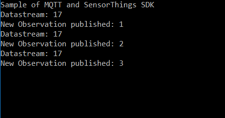
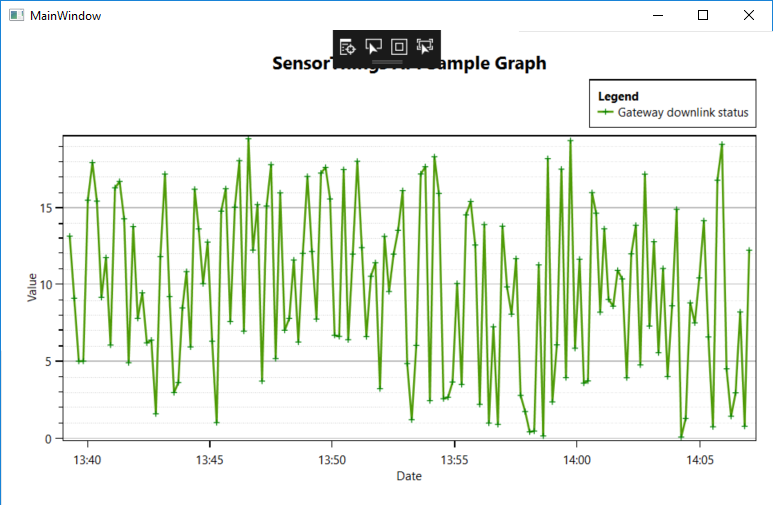

# sensorthings-net-sdk

[](https://www.nuget.org/packages/Geodan.SensorThings.SDK/)


The Geodan SensorThings .NET SDK makes it easy to add OGC SensorThings support to your .NET application.

This library is using .NET Standard 2.0

Implemented:

- HTTP GET methods

## Install

```
$ package-install Geodan.SensorThings.SDK
```

Push new version:

```
$ nuget push Geodan.SensorThings.SDK.0.2.3.nupkg -Source https://www.nuget.org/api/v2/package
```

### Sample applications

1] Console application

Description: Makes connection to SensorThings server and writes available datastreams to the console

Source: https://github.com/gost/sensorthings-net-sdk/tree/master/src/samples/ConsoleSampleApplication

2] Console application ODATA

Description:  Get Datastreams where name contains temperature including Sensor and ObservedProperty and the 5 latest observations with a result of 15 or higher. Select only id and name for datastreams and id, result and phenomenonTime for the observations

Source: https://github.com/gost/sensorthings-net-sdk/tree/master/src/samples/OdataSampleApplication

3] MqttSampleApplication

Description: Consumes MQTT SensorThings messages

Source: https://github.com/gost/sensorthings-net-sdk/tree/master/src/samples/MqttSampleApplication



4] RealtimeOxyPlotSampleApplication

Description: Display a realtime OxyPlot (http://www.oxyplot.org/) graph based on MQTT SensorThings messages (WPF sample)

Source: https://github.com/gost/sensorthings-net-sdk/tree/master/src/samples/RealtimeOxyPlotSampleApplication



5] SensorThingsRealtimeLiveChartsSample

Description: Display a realtime LiveCharts (https://www.lvcharts.net/) graph based on MQTT SensorThings messages (WPF sample)


### Dependencies

.NETStandard 2.0

System.Collections (>= 4.3.0)

System.Runtime.Extensions (>= 4.3.0)

System.Resources.ResourceManager (>= 4.3.0)

System.Runtime (>= 4.3.0)

Newtonsoft.Json (>=9.0.1)

System.Net.Http: (>=4.1.0)

### Roadmap:

- HTTP POST/PUT/DELETE

- Improve OData query support
